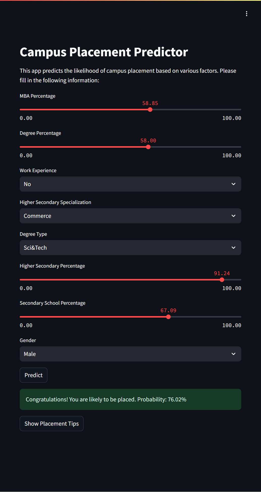

# Campus Placement Predictor



## Project Overview

The Campus Placement Predictor is a machine learning project that predicts the likelihood of a student getting placed based on various factors such as academic performance, work experience, and other relevant attributes. This project uses a Random Forest model to estimate placement probability and provides a user-friendly web interface built with Streamlit, allowing users to input their details and receive an instant placement prediction.

The predictor is based on a dataset of student information and their placement outcomes. It uses machine learning techniques to provide accurate placement predictions. The model takes into account key factors such as MBA percentage, degree percentage, work experience, specialization, and more.

This project demonstrates the application of machine learning in creating a practical tool for educational institutions and students. It serves as an excellent example of an end-to-end data science project, from data preprocessing and model training to deploying a web application with multiple hosting options.

The Campus Placement Predictor not only provides predictions but also offers tips to improve placement chances, making it a valuable tool for students preparing for campus placements and institutions looking to improve their placement rates.

## Table of Contents

1. [Dataset](#dataset)
2. [Model Training](#model-training)
3. [Streamlit Application](#streamlit-application)
4. [Deployment Options](#deployment-options)
5. [File Structure](#file-structure)
6. [Usage](#usage)

## Dataset

The dataset used for this project contains information about students and their placement outcomes. It includes the following key attributes:

1. MBA Percentage
2. Degree Percentage
3. Work Experience
4. Higher Secondary Specialization
5. Degree Type
6. Higher Secondary Percentage
7. Secondary School Percentage
8. Gender
9. Placement Status (Target variable)

The dataset can be downloaded from [Kaggle](https://www.kaggle.com/benroshan/factors-affecting-campus-placement).

## Model Training

The model training process is detailed in the `campus_placement.ipynb` notebook. This notebook covers data preprocessing, exploratory data analysis, and the implementation of the Random Forest model for placement prediction.

## Streamlit Application

The Streamlit application is defined in `app/app.py`. It provides a user interface for inputting student details and viewing the predicted placement probability. The application also includes additional information about improving placement chances.

## Deployment Options

There are four ways to deploy and use this application:

1. **Run Locally**:
   - Clone the repository:
     ```
     git clone https://github.com/pouryare/campus-placement-predictor.git
     cd campus-placement-predictor
     ```
   - Navigate to the `app` directory: `cd app`
   - Install requirements: `pip install -r requirements.txt`
   - Run the Streamlit app: `streamlit run app.py`
   - Open a web browser and go to `http://localhost:8501`

2. **Deploy on Heroku**:
   - Create a Heroku account and install the Heroku CLI.
   - Navigate to the root directory of the project.
   - Initialize a Git repository and commit your files.
   - Create a new Heroku app: `heroku create campus-placement-predictor`
   - Push your code to Heroku: `git push heroku master`

3. **Use Docker**:
   - Pull the image from Docker Hub: `docker pull pouryare/campus-placement-predictor`
   - Run the container: `docker run -p 8501:8501 pouryare/campus-placement-predictor`

   Alternatively, you can build the image locally:
   - Build the Docker image: `docker build -t pouryare/campus-placement-predictor ./app`
   - Run the container: `docker run -p 8501:8501 pouryare/campus-placement-predictor`

4. **Deploy on Azure Cloud**:
   - Have an Azure account with an active subscription. [Create an account for free](https://azure.microsoft.com/free/?ref=microsoft.com&utm_source=microsoft.com&utm_medium=docs&utm_campaign=visualstudio).
   - Install [Python 3.6 or higher](https://www.python.org/downloads/).
   - Install the [Azure CLI](https://docs.microsoft.com/en-us/cli/azure/install-azure-cli).
   - Sign in to Azure: `az login`
   - Clone the repository (if not done already):
     ```
     git clone https://github.com/pouryare/campus-placement-predictor.git
     cd campus-placement-predictor
     ```
   - Navigate to the `app` directory: `cd app`
   - Create and activate a virtual environment:
     ```
     py -3 -m venv .venv
     .venv\scripts\activate
     ```
   - Install requirements: `pip install -r requirements.txt`
   - Deploy the web app:
     ```
     az webapp up --sku B1 --name campus-placement-predictor
     ```
   - Access your app at the URL provided in the output (e.g., http://campus-placement-predictor.azurewebsites.net).

## File Structure

```
campus-placement-predictor/
├── app/
│   ├── app.py
│   ├── Dockerfile
│   ├── best_campus_placement_predictor.joblib
│   ├── Procfile
│   └── requirements.txt
├── campus_placement.ipynb
├── README.md
└── screenshot.png
```

## Usage

1. Open the application (either locally, on Heroku, via Docker, or on Azure).
2. Enter your details in the input fields provided.
3. Click the "Predict" button to view your predicted placement probability.
4. Explore additional tips for improving your placement chances.

---

This project demonstrates the application of machine learning in creating a campus placement prediction tool with a web application interface and multiple hosting options. It serves as an excellent example of an end-to-end data science project with practical applications in education and career planning.

For any issues or suggestions, please open an issue on the [GitHub repository](https://github.com/pouryare/campus-placement-predictor).
